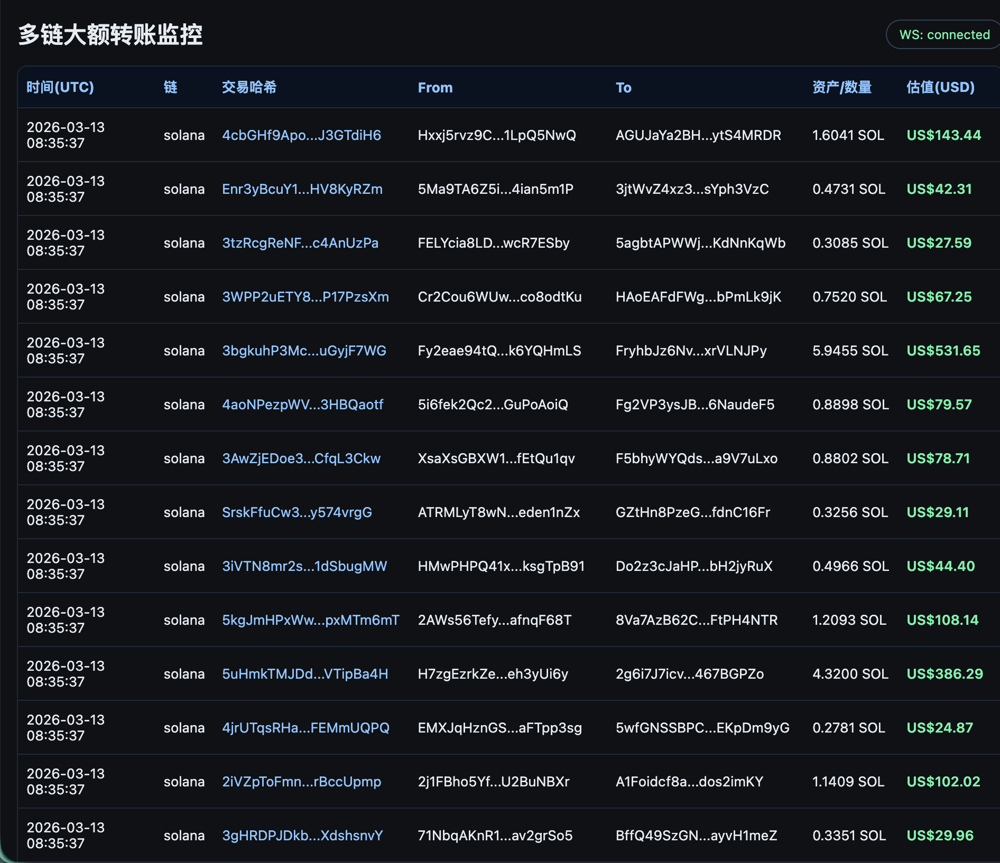

# 多链大额转账监控系统

实时监测区块链上的大额资产转移，当前支持**以太坊（ETH）**与**Solana（SOL）**，通过 ZAN 节点服务接入，前端以深色列表面板实时展示每一笔符合阈值的大额交易。



---

## 系统架构

```
┌─────────────────────────────────────────────────────────┐
│                      前端 React 面板                     │
│   WebSocket 订阅 / REST 历史接口                         │
└──────────────────────┬──────────────────────────────────┘
                       │ WebSocket / HTTP
┌──────────────────────▼──────────────────────────────────┐
│                  FastAPI 后端服务                         │
│  ┌───────────────┐   ┌────────────────┐   ┌──────────┐  │
│  │  ChainPoller  │   │ZanSolanaGrpc   │   │  WsHub   │  │
│  │  (APScheduler)│   │Subscriber      │   │ 广播推送 │  │
│  └──────┬────────┘   └───────┬────────┘   └────┬─────┘  │
│         │                   │                  │        │
│  ┌──────▼────────────────────▼────────────────▼─────┐   │
│  │            InMemoryEventStore（最近 500 条）      │   │
│  └──────────────────────────────────────────────────┘   │
└─────────────────────────────────────────────────────────┘
         │                   │
┌────────▼────────┐  ┌───────▼────────────────────────────┐
│  Etherscan API  │  │  ZAN 节点服务 (api.zan.top)         │
│  ETH 区块轮询   │  │  Solana JSON-RPC  轮询（主路径）    │
│  每 4 秒一次    │  │  Solana gRPC Yellowstone（升级路径）│
└─────────────────┘  └────────────────────────────────────┘
         │                   │
┌────────▼───────────────────▼────────┐
│   Binance 公开 API（价格换算）       │
│   ETH/USDT  SOL/USDT  每 20 秒刷新  │
└─────────────────────────────────────┘
```

---

## 项目结构

```
ai-面试/
├── start.sh                    # 一键启动脚本
├── stop.sh                     # 一键停止脚本
├── README.md                   # 本文档
├── doc/
│   └── image.png               # 运行截图
│
├── backend/                    # Python 后端
│   ├── setup_proto.sh          # 生成 gRPC proto 存根
│   ├── requirements.txt        # Python 依赖
│   ├── .env.example            # 配置模板
│   ├── .env                    # 实际配置（不提交到 git）
│   ├── proto/
│   │   ├── geyser.proto        # Yellowstone gRPC 协议定义
│   │   └── solana-storage.proto # Solana 交易结构定义
│   └── app/
│       ├── __init__.py
│       ├── main.py             # FastAPI 应用入口、路由、WebSocket
│       ├── config.py           # 环境变量配置加载
│       ├── schemas.py          # WhaleEvent 数据模型
│       ├── store.py            # 内存事件缓存（deque，防重复）
│       ├── clients.py          # HTTP 客户端（Etherscan / Solana RPC / Binance）
│       ├── detector.py         # 大额转账识别逻辑（ETH + SOL）
│       ├── poller.py           # 定时轮询（ETH 主监控 + SOL JSON-RPC 轮询）
│       ├── sol_grpc.py         # ZAN Solana gRPC 流式订阅（Yellowstone）
│       └── proto_gen/          # 自动生成的 gRPC Python 存根
│           ├── __init__.py
│           ├── geyser_pb2.py
│           ├── geyser_pb2_grpc.py
│           └── solana_storage_pb2.py
│
└── frontend/                   # React 前端
    ├── package.json
    ├── vite.config.js          # Vite 配置（代理 /api 和 /ws 到后端）
    ├── index.html
    └── src/
        ├── main.jsx            # React 应用挂载
        ├── App.jsx             # 实时列表页（WebSocket + REST）
        ├── api.js              # REST 初始加载 + WebSocket 订阅
        └── styles.css          # 深色主题样式
```

---

## 快速启动

### 前置条件

- Python 3.10+
- Node.js 18+
- Etherscan 免费 API Key（[申请地址](https://etherscan.io/register)）
- ZAN 节点 API Key（已内置测试 Key，可替换为自己的）

### 一键启动

```bash
# 1. 进入项目根目录
cd ai-面试

# 2. 配置 API Key（首次运行）
cp backend/.env.example backend/.env
# 编辑 backend/.env，填入 ETHERSCAN_API_KEY

# 3. 一键启动（自动安装依赖、生成 proto 存根、启动双端服务）
./start.sh
```

启动成功后：
- 后端 API：http://localhost:8000/api/health
- 前端面板：http://localhost:5173

```bash
# 停止所有服务
./stop.sh
```

### 手动启动

```bash
# 后端
cd backend
python3 -m venv ../.venv
../.venv/bin/pip install -r requirements.txt
bash setup_proto.sh          # 生成 gRPC proto 存根（首次或 proto 更新时）
../.venv/bin/python -m uvicorn app.main:app --host 0.0.0.0 --port 8000 --reload

# 前端（新终端）
cd frontend
npm install
npm run dev
```

---

## 配置说明

编辑 `backend/.env`：

```env
# ── 以太坊 ────────────────────────────────────────────────
ETHERSCAN_API_KEY=your_etherscan_api_key   # 申请：https://etherscan.io
ETH_POLL_SECONDS=4                          # ETH 区块拉取间隔（秒）

# ── Solana（ZAN 节点，JSON-RPC 主路径，开箱即用）─────────
ZAN_API_KEY=25a51188cb25466986e5d7e48c6217e9
ZAN_SOL_RPC_URL=https://api.zan.top/node/v1/solana/mainnet/25a51188cb25466986e5d7e48c6217e9
SOL_POLL_SECONDS=8                          # Solana 轮询间隔（秒）

# ── Solana gRPC（升级路径，需在 ZAN 控制台开通 Geyser 权限）─
ZAN_GRPC_ENDPOINT=grpc.zan.top:443
ZAN_GRPC_ENABLED=true    # 未开通 gRPC 时设为 false 可消除重试日志

# ── 阈值与存储 ────────────────────────────────────────────
ETH_USD_THRESHOLD=100000   # 大额转账阈值（USD）
EVENT_STORE_LIMIT=500       # 内存缓存事件数量上限
CORS_ORIGINS=http://localhost:5173
```

---

## API 接口

| 方法 | 路径 | 说明 |
|------|------|------|
| GET | `/api/health` | 服务健康检查，返回最新区块号、Slot、已缓存事件数 |
| GET | `/api/events?limit=100` | 获取历史大额转账事件列表 |
| WS | `/ws/events` | WebSocket 实时推送新增大额转账事件 |

### 事件数据结构

```json
{
  "chain": "solana",
  "tx_hash": "4cbGHf9Apo...J3GTdiH6",
  "block_ref": "406099387",
  "timestamp": "2026-03-13T08:35:37Z",
  "from_address": "Hxxj5rvz9C...1LpQ5NwQ",
  "to_address": "AGUJaYa2BH...ytS4MRDR",
  "asset": "SOL",
  "amount": 1.6041,
  "usd_value": 143.44,
  "explorer_url": "https://solscan.io/tx/4cbGHf9Apo...J3GTdiH6"
}
```

---

## Solana 双路径说明

| 路径 | 方式 | 延迟 | 条件 |
|------|------|------|------|
| JSON-RPC 轮询 | 定时拉取最新 Slot 并解析交易 | ~8 秒 | 开箱即用 |
| gRPC Yellowstone 流 | 长连接实时推送每笔交易 | < 1 秒 | 需在 ZAN 控制台开通 Geyser 权限 |

两条路径**同时运行**，gRPC 连接成功时会提供更低延迟的实时数据；未开通时 JSON-RPC 轮询作为保底路径持续工作。

开通 gRPC：登录 [zan.top](https://zan.top) → API Keys → 对应 Key → 开启「Yellowstone gRPC / Geyser」

---

## 后续可扩展：多链监听

系统采用**统一事件模型**（`WhaleEvent`）和**模块化采集器**设计，新增链只需添加以下三个部分：

### 1. 新增 HTTP 客户端

在 `backend/app/clients.py` 添加对应 RPC 客户端：

```python
class BscClient:                     # BNB Smart Chain
    async def get_block(self, ...): ...

class PolygonClient:                  # Polygon PoS
    async def get_block(self, ...): ...
```

ZAN 已支持的可直接接入的链（参考 [docs.zan.top](https://docs.zan.top/reference/zan_getnftmetadata-advanced)）：

| 链 | ZAN 节点 URL 格式 |
|---|---|
| BNB Smart Chain | `https://api.zan.top/node/v1/bsc/mainnet/{apiKey}` |
| Polygon PoS | `https://api.zan.top/node/v1/polygon/mainnet/{apiKey}` |
| Arbitrum | `https://api.zan.top/node/v1/arb/mainnet/{apiKey}` |
| Optimism | `https://api.zan.top/node/v1/opt/mainnet/{apiKey}` |
| Base | `https://api.zan.top/node/v1/base/mainnet/{apiKey}` |
| Avalanche | `https://api.zan.top/node/v1/avax/mainnet/{apiKey}` |
| Sui | `https://api.zan.top/node/v1/sui/mainnet/{apiKey}` |

### 2. 新增大额转账解析器

在 `backend/app/detector.py` 添加对应链的解析函数：

```python
def parse_bsc_whale_transfers(block, bnb_usd, threshold_usd) -> list[WhaleEvent]:
    # EVM 链结构相同，与 ETH 解析逻辑基本一致
    ...
```

### 3. 注册到轮询器

在 `backend/app/poller.py` 的 `ChainPoller` 中注册新的轮询任务：

```python
self.scheduler.add_job(
    self.poll_bsc,
    "interval",
    seconds=settings.bsc_poll_seconds,
)
```

> EVM 兼容链（BSC / Polygon / Arbitrum / Optimism / Base）的区块结构与以太坊完全相同，`parse_eth_whale_transfers` 函数可**直接复用**，只需传入对应的 RPC 客户端和原生代币价格即可。

---

## 技术栈

| 层 | 技术 |
|---|---|
| 后端框架 | FastAPI + uvicorn |
| 异步 HTTP | httpx |
| 定时调度 | APScheduler |
| gRPC 流式 | grpcio + grpcio-tools（Yellowstone Geyser 协议） |
| 数据验证 | Pydantic v2 |
| 前端框架 | React 18 + Vite |
| 实时通信 | WebSocket（浏览器原生） |
| 数据来源 | Etherscan API / ZAN 节点 / Binance 公开 API |
